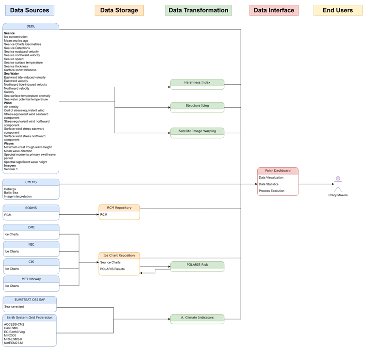

[[mainRequirements]]
= Software Requirements Specification

This chapter lists the software requirements with a requirements matrix and references to documents.

[cols="1,1,1,2,6,1"]
|=== 
| Doc | Reference | Use Case | Title | Short Description | Compliance

|UCD
|REQ01
|Climate Indicators, Baltic Shipping, Arctic Shipping
|DESIDE dashboard
|DESIDE shall provide a dashboard allowing users to interactively explore processed, integrated and combined dataset for the various covered regions and projections.
|C

|UCD
|REQ02
|Climate Indicators, Baltic Shipping, Arctic Shipping
|Polar TEP workspace
|DESIDE shall provide access to a Polar TEP workspace allowing users to develop computer programs that use the DESIDE datasets.
|C

|UCD
|REQ03
|Baltic Shipping, Arctic Shipping
|IcySea
|DESIDE shall provide access to the IcySea app allowing shipboard users to access sea ice information needed for tactical navigation.
|C

|UCD
|REQ04
|Climate Indicators
|Climate Indicators
|Within the DESIDE dashboard, users shall be able to compare historical sea ice indicators with future projections. This will include data from the DestinE Digital Twin.
|P, in development. The first climate model examples are shown in the polar dashboard. Data from the Digital Twin is being added.

|UCD
|REQ05
|Baltic Shipping
|Baltic CMEMS Data
a|The DESIDE dashboard and Polar TEP workspace shall provide access to the following data served from CMEMS:
* BALTICSEA_ANALYSISFORECAST_PHY_003_006
* BALTICSEA_ANALYSISFORECAST_WAV_003_010
* SEAICE_BAL_SEAICE_L4_NRT_OBSERVATIONS_011_004
* SEAICE_BAL_SEAICE_L4_NRT_OBSERVATIONS_011_011
|P, in development.

|UCD
|REQ06
|Arctic Shipping
|Arctic DESP Data 
a|The DESIDE dashboard and Polar TEP workspace shall provide access to the following data served from DESP:
* GLOBAL_ANALYSISFORECAST_PHY_001_024
* GLOBAL_ANALYSISFORECAST_WAV_001_027
* WIND_GLO_PHY_L4_NRT_012_004
Note: The availability of this data on DESP is a precondition.
|P, in development. CMEMS data are currently shown in the DESIDE dashboard.

|UCD
|REQ07
|Arctic Shipping
|Arctic CMEMS Data 
a|The DESIDE dashboard and Polar TEP workspace shall provide access to the following data served from CMEMS:
* SEAICE_ARC_SEAICE_L4_NRT_OBSERVATIONS_011_007
|C

|UCD
|REQ08
|Baltic Shipping, Arctic Shipping
|Data Statistics
a|The DESIDE dashboard shall allow calculation of data statistics for user selected regions of interest.
|C

|UCD
|REQ09
|Arctic Shipping
|Harshness Index
a|The DESIDE dashboard shall provide the capability to calculate a Harshness Index based on a selection of environmental variables chosen by the user.
|C

|UCD
|REQ10
|Arctic Shipping
|Sentinel 1 Image Warping
a|The DESIDE dashboard and IcySea shall provide the capability to warp Sentinel 1 images based on sea ice drift forecasts.
|C

|UCD
|REQ11
|Arctic Shipping
|Structure Icing
a|The DESIDE dashboard shall provide the capability to the probability of encountering sturucture icing in a region based on historical data.
|C

|UCD
|REQ12
|Arctic Shipping
|POLARIS Risk
a|The DESIDE dashboard and IcySea shall provide the capability to calculate the risk to a ship from sea ice given the ship's ice classification and current sea ice conditions.
|C

|UCD
|REQ13
|Arctic Shipping
|Sentinel 1 Image Interpretation
a|The DESIDE dashboard shall provide interpretation of sea ice conditions from Sentinel 1 images using a Machine Learning trained algorithm.
|C

|UCD
|REQ14
|Arctic Shipping
|RCM Data
a|The DESIDE dashboard and Polar TEP workspace shall provide access to the RADARSAT Constellation Mission (RCM) SAR imagery
|P, in development.

|UCD
|REQ15
|Arctic Shipping
|Sea Ice Charts
a|The DESIDE dashboard and Polar TEP workspace shall provide access to Sea Ice Charts.
|C
|===

== DESIDE project diagram

.DESIDE diagram

