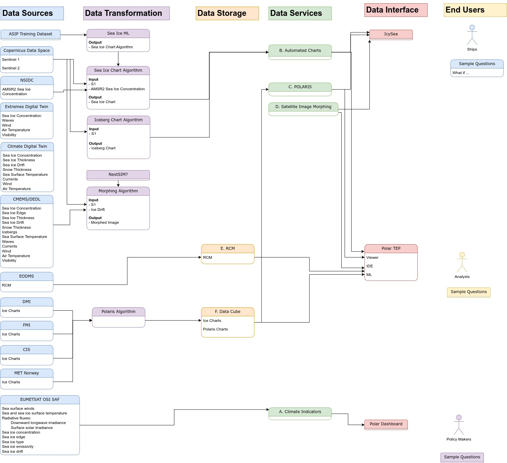

[[mainRequirements]]
= Software Requirements Specification

This chapter lists the software requirements with a requirements matrix and references to documents.

[cols="1,1,1,2,6,1"]
|===
| Doc | Reference | Section | Title | Short Description | Compliance

|UCD
|REQ01
|3.2., 3.3., & 3.4.
|Interactive dashboard
|DESIDE shall provide an online dashboard allowing users to interactively explore processed, integrated and combined dataset for the various covered regions and projections. Within the interactive dashboard users shall be able to compare historical sea ice indicators with future projections in order to establish a trust in future projections based on historical performance.
|P, more data and analysis features are added in the Polar dashboard.

|UCD
|REQ02
|3.2., 3.3., & 3.4.
|Data access
|Access to sea ice data including ice movement observations using both buoys and radars as well as forecasts of sea-ice movement and compression, and volume and deformation characteristics of sea ice shall be demonstrated and provided.
|P, a first draft Jupyter notebook showing data access is available. More data needs to be made accessible through DESP platfrom and access demonstrated in the notebook.

|UCD
|REQ03
|3.4.
|Data transfer between IcySea and Polar TEP
|The exchanging and sending of data between Polar TEP and IcySea application for display and analysis in both platforms shall be supported.
|P, in development. First data examples are shown in the polar dashboard.

|UCD
|REQ04
|3.2.
|Available DESP Data 
a|The interactive dashboard and notebook shall provide access to the following data served from DESP:

* TOPAZ4b - Arctic Ocean Physics Reanalysis
* TOPAZ5 - Arctic Ocean Physics Analysis And Forecast
* All data referenced in the "Pre-conditions" row of the table in 3.2. of the UCD.
Note: The availability of this data on DESP is a precondition.
|N, as precondition is not met.

|UCD
|REQ05
|3.2.
|Available Data
a|The interactive dashboard and notebook shall still provide access to the following data in case it will not be available on DESP:

* TOPAZ4b - Arctic Ocean Physics Reanalysis
* TOPAZ5 - Arctic Ocean Physics Analysis And Forecast
|C

|UCD
|REQ06
|3.3.
|Available DESP Data 
a|The interactive dashboard and notebook shall provide access to the following data served from DESP:

* TOPAZ4b - Arctic Ocean Physics Reanalysis
* TOPAZ5 - Arctic Ocean Physics Analysis And Forecast
* All data referenced in the "Pre-conditions" row of the table in 3.3. of the UCD.
Note: The availability of this data on DESP is a precondition.
|N, as precondition is not met.

|UCD
|REQ07
|3.3.
|Available Data
a|The interactive dashboard and notebook shall still provide access to the following data in case it will not be available on DESP:

* TOPAZ4b - Arctic Ocean Physics Reanalysis
* TOPAZ5 - Arctic Ocean Physics Analysis And Forecast
|C

|UCD
|REQ08
|3.4.
|Available DESP Data 
a|The interactive dashboard and notebook shall provide access to the following data served from DESP:

* TOPAZ4b - Arctic Ocean Physics Reanalysis
* TOPAZ5 - Arctic Ocean Physics Analysis And Forecast
* All data referenced in the "Pre-conditions" row of the table in 3.4. of the UCD.
Note: The availability of this data on DESP is a precondition.
|N, as precondition is not met.

|UCD
|REQ09
|3.4.
|Available Data
a|The interactive dashboard and notebook shall still provide access to the following data in case it will not be available on DESP:

* TOPAZ4b - Arctic Ocean Physics Reanalysis
* TOPAZ5 - Arctic Ocean Physics Analysis And Forecast
|C

|UCD
|REQ10
|3.4.
|Available Data
a|The interactive dashboard shall provide access to the RADARSAT Constellation Mission (RCM) SAR imagery
|C

|UCD
|REQ11
|3.4.
|Available Data
a|Sea Ice Charts are available for display in dashboard and as input for POLARIS algorithm
|C
|===

== DESIDE project diagram

.DESIDE diagram

