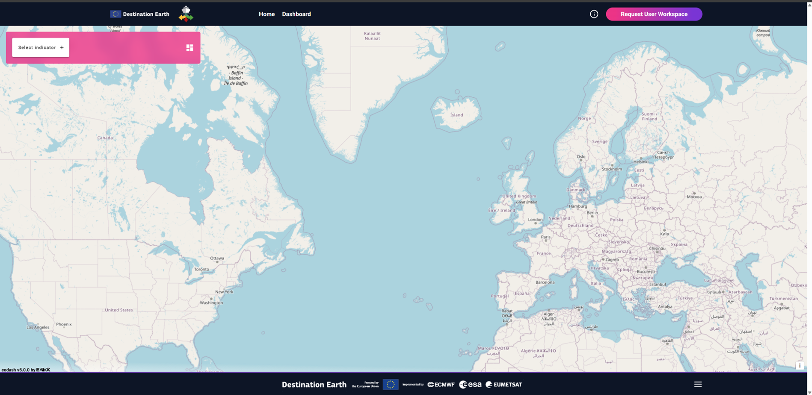
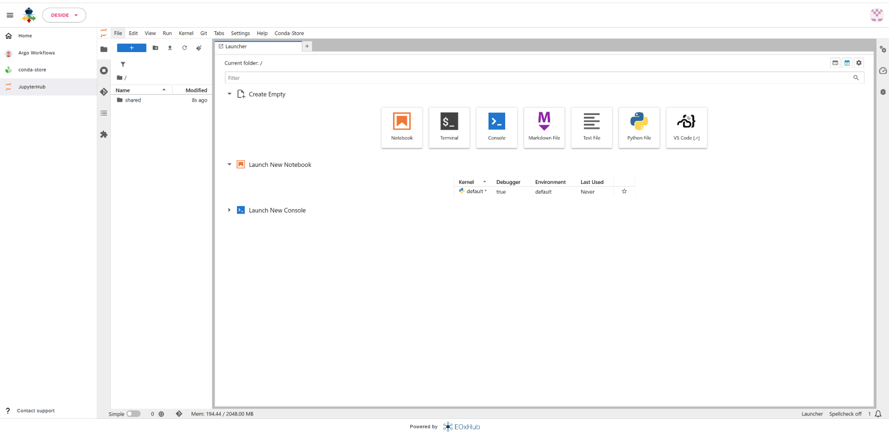
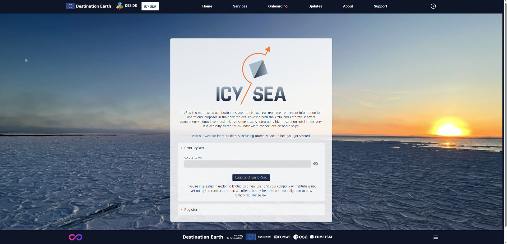
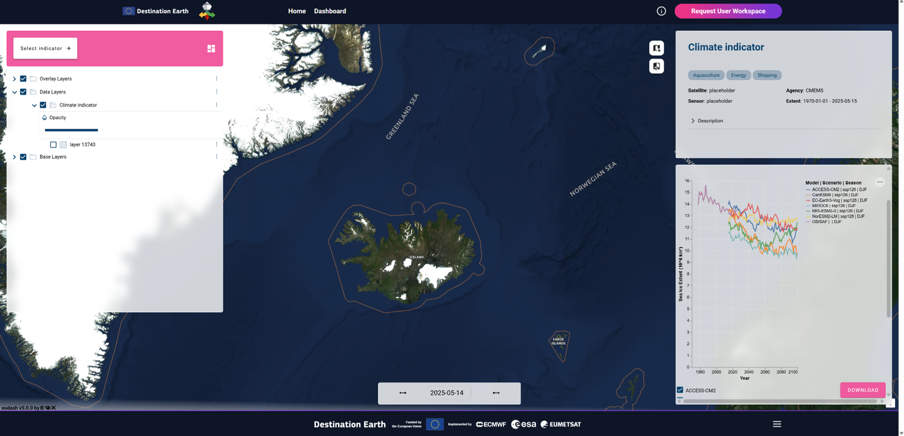
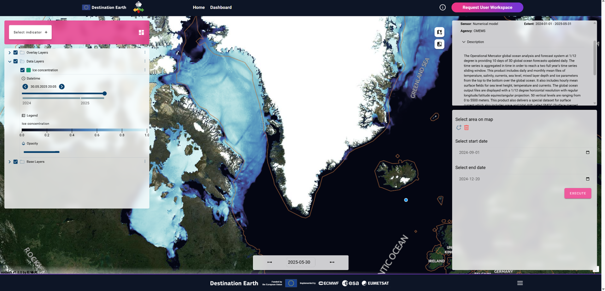
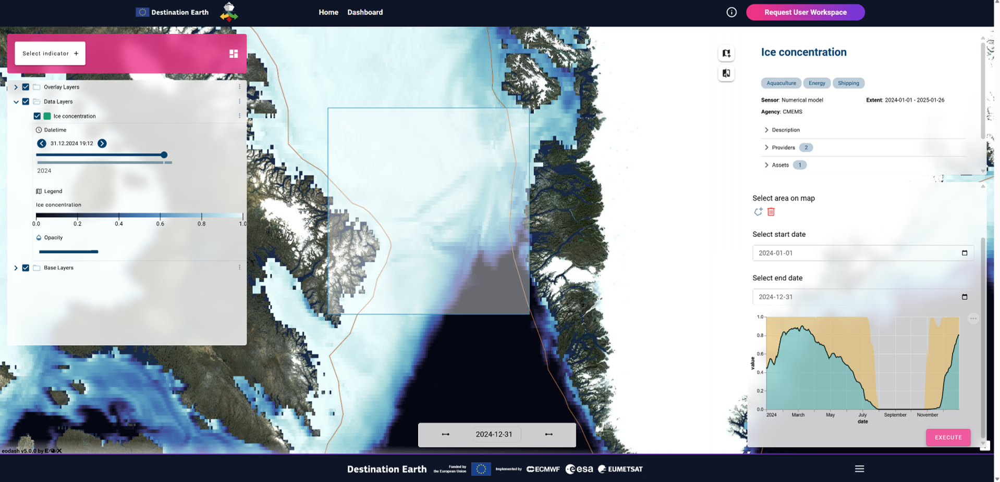
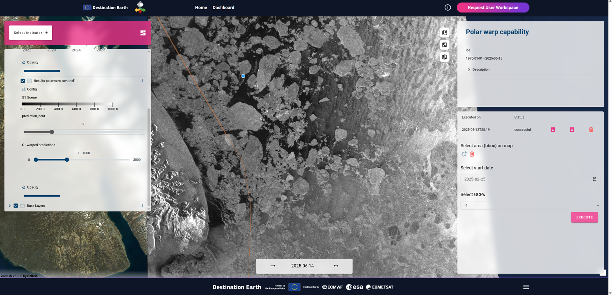
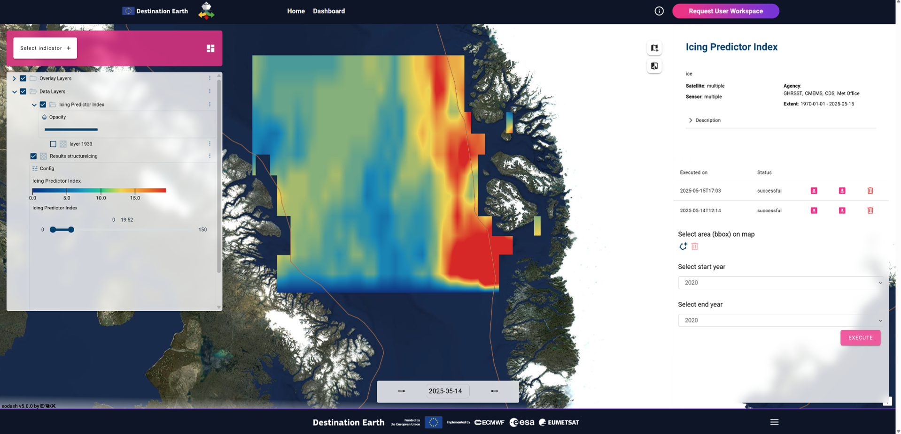
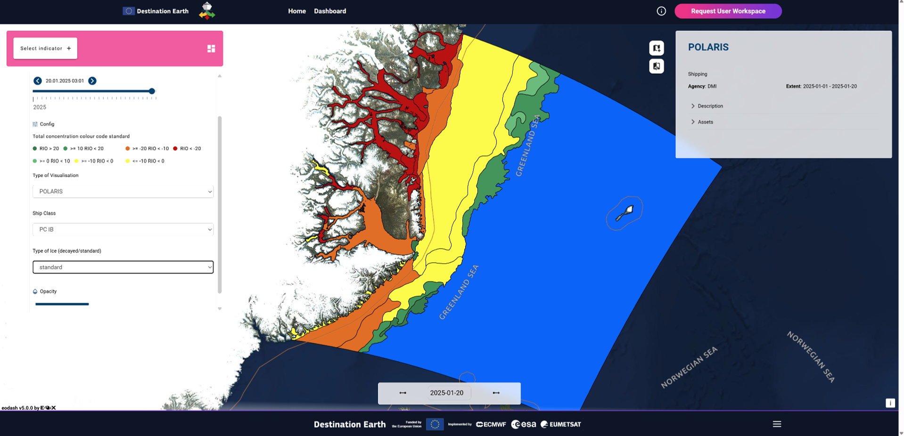
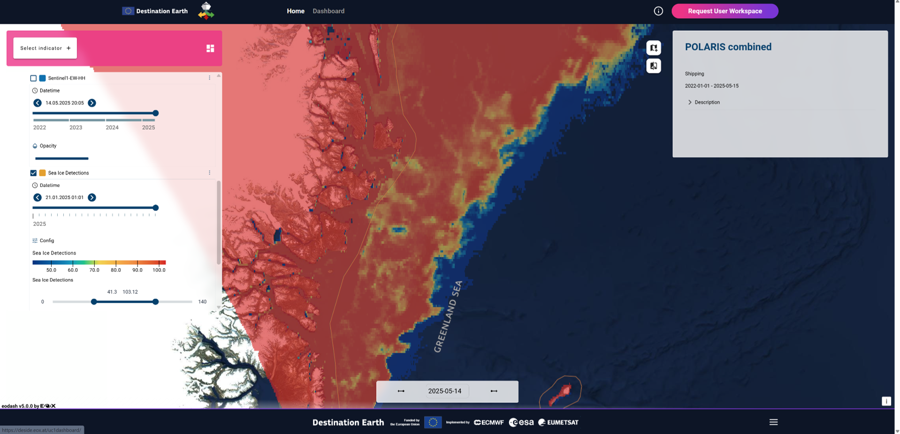

= Results of verification activities

This section describe results of testing activities described in Software Verification and Validation Plan (SVVP).

== REQ01 DESIDE Dashboard

.REQ01 Dashboard

== REQ02 Polar TEP

.REQ02 Polar TEP

== REQ03 IcySea

.REQ03 IcySea

== REQ04 Climate Indicators

.REQ04 Climate Indicators

== REQ05 Baltic CMEMS Data

.REQ05 Baltic CMEMS Data
image::../images/REQ05_Baltic_CMEMS_Data.png[REQ05 Baltic CMEMS Data]
In preparation.

== REQ06 Arctic DESP Data

.REQ06 Arctic DESP Data
image::../images/REQ06_ARctic_DESP_Data.png[REQ06 Arctic DESP Data]
In preparation.

== REQ07 Arctic CMEMS Data

.REQ07 Arctic CMEMS Data

== REQ08 Data Statistics

.REQ08 Data Statistics

== REQ09 Harshness Index

.REQ09 Harshness Index
image::../images/REQ09_Harshness_Index.png[REQ09 Harshness Index]

== REQ10 Image Warping

.REQ10 Image Warping

== REQ11 Structure Icing

.REQ11 Structure Icing

== REQ12 POLARIS Risk

.REQ12 POLARIS Risk

== REQ13 Image Interpretation

.REQ13 Image Interpretation

== REQ14 RCM Data

.REQ14 RCM Data
image::../images/REQ14_RCM_Data.png[REQ14 RCM Data]
In preparation.

== REQ15 Sea Ice Charts

.REQ15 Sea Ice Charts
image::../images/REQ15_Sea_Ice_Charts.png[REQ15 Sea Ice Charts]
In preparation.

== REQ02 Polar TEP

Demonstration of possibility to access CMEMS dataset from Destination Earth Data Lake. Attached Jupyter notebook in PDF form is showing possibility to access, download and visualize the data in Polar TEP IDE.  

:pdf-attachment: ../images/hda-pystac-client.pdf
link:{pdf-attachment}[Download PDF]

