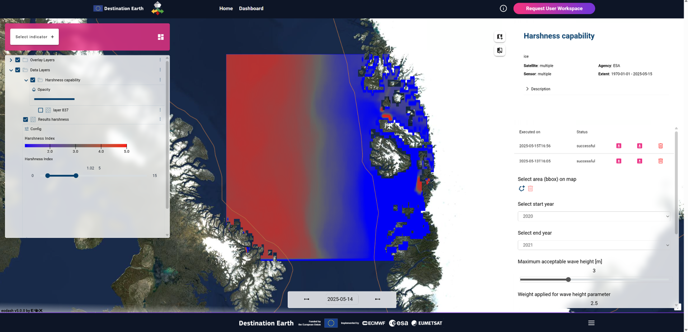

= Results of verification activities

This section describes results of testing activities described in the Software Verification and Validation Plan (SVVP).

== REQ01 DESIDE Dashboard

Requirement: The DESIDE Dashboard is operational. +
Verification: Demonstration at https://deside.polarview.org/ and selecting "Dashboard" or at https://deside.eox.at. Select "Dashboard" in the main menu.

.REQ01 DESIDE Dashboard
image::../images/REQ01_Dashboard.png[REQ01 DESIDE Dashboard]

== REQ02 Polar TEP

Requirement: The Polar TEP workspace is operational. +
Verification: Demonstration at https://deside.polarview.org/ and selecting "Polar TEP" or at  https://deside.eox.at and selecting "Request User Workspace" in the main menu. +

Instructions for accessing CMEMS datasets from Destination Earth Data Lake showing how to download and visualize the data in a Polar TEP IDE:  

:pdf-attachment: ../images/hda-pystac-client.pdf
link:{pdf-attachment}[Download PDF]

.REQ02 Polar TEP
image::../images/REQ02_Polar_TEP.png[REQ02 Polar TEP]

== REQ03 IcySea

Requirement: The IcySea app is operational. +
Verification: Demonstration at https://icysea.app/deside.html +

.REQ03 IcySea

== REQ04 Climate Indicators

Requirement: The climate indicators are accessible via the DESIDE dashboard for visualisation. +
Verification: Demonstration by selecting "Select indicator +" and then "Climate Indicator" under the "Capabilities" submenu. The climate indicator graph is shown in the bottom right window. Different models, scenarios, and timeframes can be selected. The"..." menu provides options to download a picture of the graph or access the graph in the Vega Editor. +

.REQ04 Climate Indicators
image::../images/REQ04_Climate_Indicators.png[REQ04 Climate Indicators]

== REQ05 Baltic CMEMS Data

Requirement: The available CMEMS data are accessible via the DESIDE dashboard for visualisation and in a Polar TEP workspace for processing. +
Verification: Demonstration in preparation. +

.REQ05 Baltic CMEMS Data
// image::../images/REQ05_Baltic_CMEMS_Data.png[REQ05 Baltic CMEMS Data]

== REQ06 Arctic DESP Data

Requirement: The available DESP data are accessible via the DESIDE dashboard for visualisation and in a Polar TEP workspace for processing. +
Verification: Demonstration in preparation. +

.REQ06 Arctic DESP Data
// image::../images/REQ06_ARctic_DESP_Data.png[REQ06 Arctic DESP Data]

== REQ07 Arctic CMEMS Data

Requirement: The available CMEMS data are accessible via the DESIDE dashboard for visualisation and in a Polar TEP workspace for processing. +
Verification: Demonstration by selecting "Select indicator +" and then any data variable. The figure below shows "Sea Ice Concentration".  +

.REQ07 Arctic CMEMS Data
image::../images/REQ07_Arctic_CMEMS_Data.png[REQ07 Arctic CMEMS Data]

== REQ08 Data Statistics

Requirement: Data statistics for user selected regions of interest are accessible via the DESIDE dashboard for visualisation. +
Verification: Demonstration by selecting "Select indicator +" and then any data variable. Draw a region of interest using the cursor. Select start and end dates in the bottom right window. Click on the "Execute" button in the bottom right window. The data is graphed and individual statistics can be seen by hovering over the graph. The figure below shows "Sea Ice Concentration".  +

.REQ08 Data Statistics

== REQ09 Harshness Index

Requirement: The result of calculating a harshness index is accessible via the DESIDE dashboard for visualisation. +
Verification: Demonstration by selecting "Select indicator +" and then and then "Harshness Capability" under the "Capabilities" submenu. Select a region of interest. Adjust the parameter values and weights using the slide bars in the bottom right window. Click on "Execute".  Previous runs are available for retrieval. +

.REQ09 Harshness Index

== REQ10 Image Warping

Requirement: The result of warping a Sentinel 1 image based on sea ice drift forecasts is accessible via the DESIDE dashboard for visualisation. +
Verification: Demonstration by selecting "Select indicator +" and then and then "Polar Warp Capability" under the "Capabilities" submenu. Select a region of interest. Select a date. Select the number of Ground Control Points (GCP) - a higher number provides better resolution but takes lonnger to run. Click on "Execute".  Previous runs are available for retrieval. +

.REQ10 Image Warping
image::../images/REQ10_Image_Warping.png[REQ10 Image Warping]

== REQ11 Structure Icing

Requirement: The probability of structure icing is accessible via the DESIDE dashboard for visualisation. +
Verification: Demonstration by selecting "Select indicator +" and then and then "Icing Predictor Index" under the "Capabilities" submenu. Select a region of interest. Select a date range in the bottom right window. Click on "Execute".  Previous runs are available for retrieval. +

.REQ11 Structure Icing
image::../images/REQ11_Structure_Icing.png[REQ11 Structure Icing]

== REQ12 POLARIS Risk

Requirement: The risk to a ship from sea ice is accessible via the DESIDE dashboard for visualisation. +
Verification: Demonstration by selecting "Select indicator +" and then and then "POLARIS" under the "Capabilities" submenu. Select a date in the top left window. Select "POLARIS" as the "Type of Visualisation". Select the "Ship Class".  Select the Type of Ice (decayed/standard)". More information about the ice is available by hovering over the map polygons. +

.REQ12 POLARIS Risk

== REQ13 Image Interpretation

Requirement: ML interpretation of sea ice characteristics from Sentinel 1 images is accessible via the DESIDE dashboard for visualisation. +
Verification: Demonstration by selecting "Select indicator +" and then and then "POLARIS Combined" under the "Capabilities" submenu. Results are shown as the "Sea Ice Detections" layer. +

.REQ13 Image Interpretation
image::../images/REQ13_Image_Interpretation.png[REQ13 Image Interpretation]

== REQ14 RCM Data

Requirement: The available RCM data are accessible via the DESIDE dashboard for visualisation and in a Polar TEP workspace for processing. +
Verification: Demonstration in preparation. +

.REQ14 RCM Data
// image::../images/REQ14_RCM_Data.png[REQ14 RCM Data]
In preparation.

== REQ15 Sea Ice Charts

Requirement: The available sea ice charts are accessible via the DESIDE dashboard for visualisation, in a Polar TEP workspace for processing, and usable by the POLARIS algorithm. +
Verification: Demonstration by selecting "Select indicator +" and then and then "POLARIS" under the "Capabilities" submenu. Select a date in the top left window. Select "WMO Concentration" or "WMO Stage of Development" as the "Type of Visualisation". More information about the ice is available by hovering over the map polygons. +

.REQ15 Sea Ice Charts

