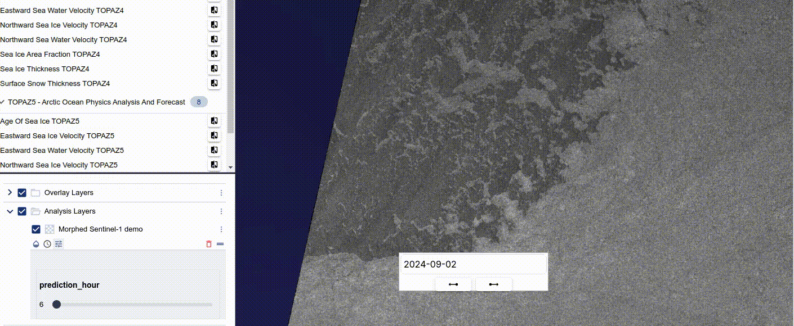

= Results of verification activities

This section describe results of testing activities described in Software Verification and Validation Plan (SVVP).

== Interactive Dashboard

Demonstration of added datasets into the interactive online dashboard

.sea_ice_area_fraction

.surface_snow_thicknes

.sea_ice_velocity

== Data Access

Demonstration of possibility to access CMEMS dataset from Destination Earth Data Lake. Attached Jupyter notebook in PDF form is showing possibility to access, download and visualize the data in Polar TEP IDE.  

:pdf-attachment: ../images/hda_pystac_client.pdf
link:{pdf-attachment}[Download PDF]

== Data transfer between IcySea and Polar TEP

Currently work in progress. 

First version of S1 morphed images is displayed in the Polar Dashboard.

.s1_morphed_images

== Available DESP Data 

Waiting for data to be available on DESP.

== Available Data 

See Data Access above.

Additionaly Sea Ice Charts are visualized in the dashboard.

.sea_ice_charts
